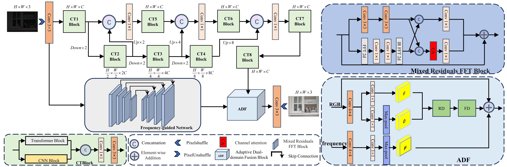
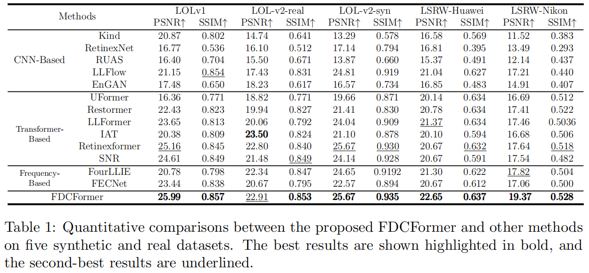
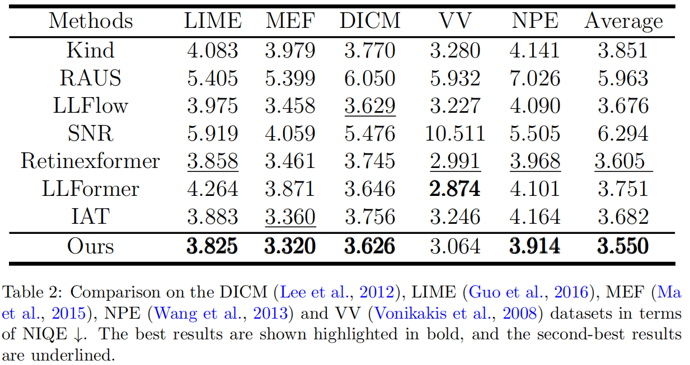

# FDCFormer: Frequency-guided Dual Collapse Transformer for Low-Light Image Enhancement

## Datasets
You can use the following links to download the datasets:

LOL-v1 [Baidu Disk](https://pan.baidu.com/s/1ZAC9TWR-YeuLIkWs3L7z4g?pwd=cyh2) (code: `cyh2`), [Google Drive](https://drive.google.com/file/d/1L-kqSQyrmMueBh_ziWoPFhfsAh50h20H/view?usp=sharing)

LOL-v2 [Baidu Disk](https://pan.baidu.com/s/1X4HykuVL_1WyB3LWJJhBQg?pwd=cyh2) (code: `cyh2`), [Google Drive](https://drive.google.com/file/d/1Ou9EljYZW8o5dbDCf9R34FS8Pd8kEp2U/view?usp=sharing)

LSRW [Baidu Disk](https://pan.baidu.com/s/1XHWQAS0ZNrnCyZ-bq7MKvA) (code: `wmrr`)

## Requirements
Python3, pytorch > 1.0

Create Conda Environment 
```
conda create -n FDCFormer python=3.8
conda activate FDCFormer
pip install matplotlib  opencv-python yacs joblib natsort h5py tqdm pytorch_msssim tensorboardX einops ptflops thop torchsummary scikit-image==0.19.3
```
## Network Architecture


## Quantitative results
### Results on five publicly available paired datasets



### Results on five unpaired datasets
<div style="text-align:center;">
    
</div>

## Get Started
### Test
You can directly test the pre-trained model as follows

1. Modify the paths to dataset and pre-trained mode. 
```python
# Tesing parameter 
input_dir # the path of data
result_dir # the save path of results 
weights # the weight path of the pre-trained model
```

2. Test the models for LOL 

You need to specify the data path ```input_dir```, ```result_dir```, and model path ```weight_path```. Then run
```bash
python test.py --input_dir your_data_path --result_dir your_save_path --weights weight_path

```
### Train
```bash
python train_lolv1.py -yml_path your_config_path
```
### Visual Comparison  
- Evaluation on LOL dataset  
  

- Evaluation on LOL-v2 dataset  
  

- Evaluation on LSRW-huawei dataset  


## Contact

If you have any questions, please contact laifangwei2000@163.com

---

## Reference Repositories
This implementation is based on  inspired by:
- LLFormer: https://github.com/TaoWangzj/LLFormer
---

